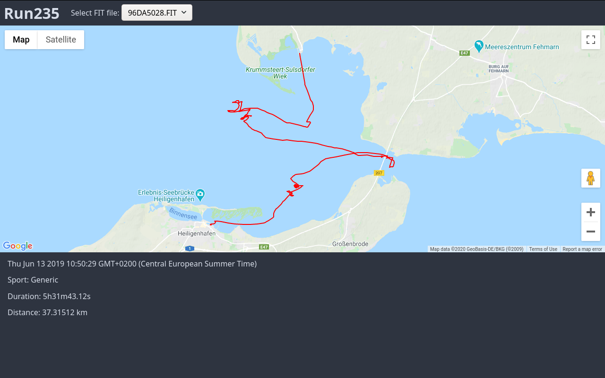

# run235
Experimenting with visualizations for .FIT files from a Garmin Forerunner 235.

## Setup

 1. Get an [API key for Google
    Maps](https://developers.google.com/maps/documentation/javascript/get-api-key)
    and allow it to be used by `http://localhost:8080`
 2. Save it to `gcp.key`
 3. Execute `go run . -basedir /mnt/watch/GARMIN/ACTIVITY/`
 4. Open <http://localhost:8080>

